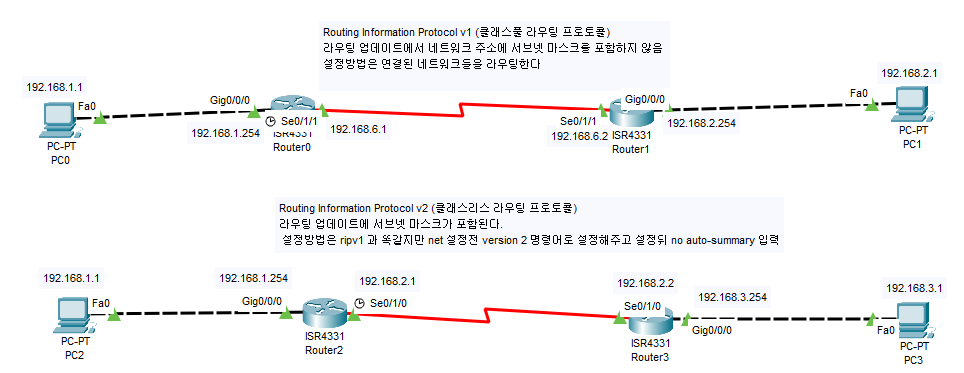

# Routing Information Protocol
## RIP 은 거리 벡터 라우팅 프로토콜이다.    
### RIP v1 은 라우터에 연결된 네트워크 주소를 동적으로 라우팅 시켜주는데 그 과정에서 브로드 캐스트 주소(255.255.255.255) 를 사용하고 네트워크 정보에 서브넷 마스크의 정보를 담지 않는다. 
### RIP v2 은 v1 에서 서브넷 마스크의 정보가 담기고 라우팅 정보 전송시 멀티캐스트 주소(224.0.0.9) 를 사용하도록 변경된 것이다.

- - -
## RIP v1 cli 명령어
en   - 권한 활성화   
conf t   - 설정 모드   
router rip   - rip 사용   
net '인접 네트워크 주소'    - 라우팅   
...   
## RIP v2 cli 명령어
en - 권한 활성화   
conf t - 설정모드   
router rip - rip 사용   
version 2 - rip v2 로 전환   
net '인접 네트워크 주소' - 라우팅   
...   
no auto-summary - 자동 요약 기능 해제   