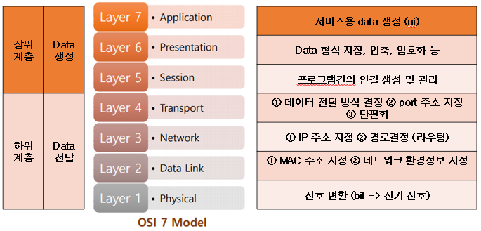

 # 네트워크 모델   
 네트워크 통신의 최대의 효율성과 안정성을 보장하기 위한 개념적 구조   
 >## 특징   
 - 계층적인 구조   
 - 기능별 모듈화   
 >## 종류   
 ### TCP/IP 모델  
- 실 통신용   
 ### OSI 7 계층  
- 장비 개발   
- 문제 해결   
- 유지 보수   
- 학습
# OSI 7 Layer (Model)   

# TCP/IP protocol suite (통신규약)
