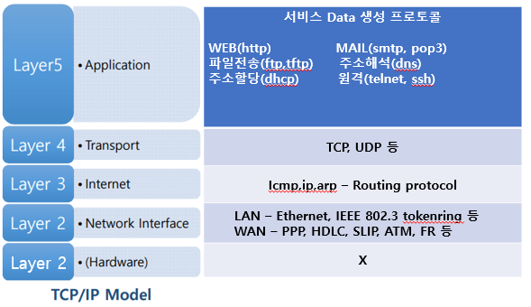

 # 네트워크 모델   
 네트워크 통신의 최대의 효율성과 안정성을 보장하기 위한 개념적 구조   
 >## 특징   
 - 계층적인 구조   
 - 기능별 모듈화   
 >## 종류   
 ### TCP/IP 모델  
- 실 통신용   
 ### OSI 7 계층  
- 장비 개발   
- 문제 해결   
- 유지 보수   
- 학습
# OSI 7 Layer (Model)   

# TCP/IP protocol suite (통신규약)

- - -
# 관련 용어   
## Encapsulation   
각 계층에서 프로토콜에 의해 생성된 정보(header)를 상위계층에서 전달받은 데이터에 덧붙이는 과정   
## De-encapsulation   
각 계층에서 해당 계층의 정보(header)를 해석하여 계층의 역할을 수행하는 과정   
## header   
각 계층에서 프로토콜에 의해 생성되는 추가 정보   
## Footer(trailer)   
- 2계층에서만 추가 됨   
- 네트워크 전송용 데이터 생성이 완료되었을 때 전체 데이터에 대한 오류 검출을 제공하기 위한 값   
## PDU (Protocol Data Unit)   
추가된 header 와 상위 계층의 데이터가 합쳐진 한 계층의 전체 데이터   
## SDU (Service Data Unit -> payload)   
PDU 에서 header 가 제거된 상위 계층에서 전달받은 data