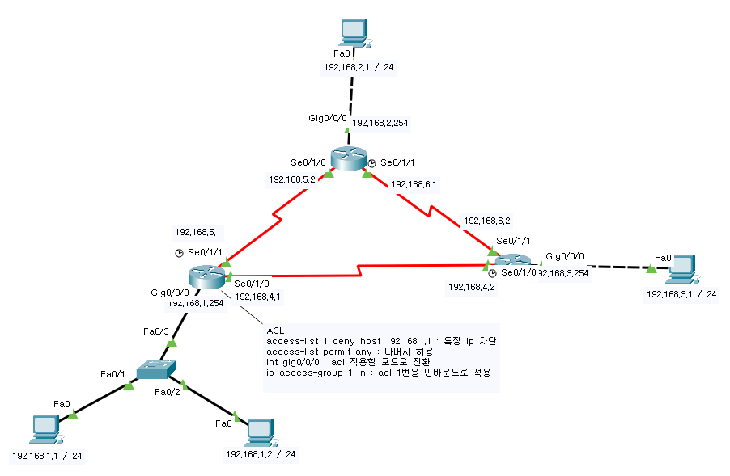
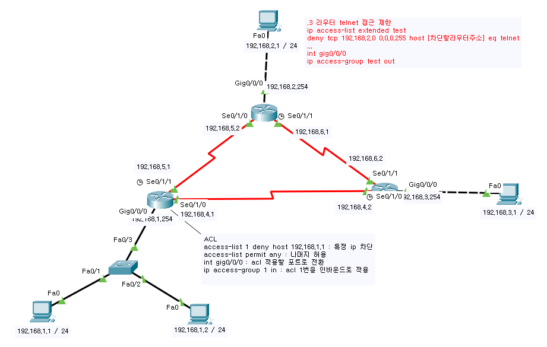

# ACL (Access Control List) 
Interface 로 들어오고 나가는 패킷이 담고있는 정보를 토대로 정해진 규칙에 따라 패킷을 허용/차단 함으로써 네트워크 접근 제어를 할 수 있다. 
- acl 은 순차적으로 검토되기 때문에 거름망처럼 사용해야한다. (처음부터 다 막으면 안된다)   
### ACL 생성후 적용   
적용할 인터페이스로 전환한뒤   
ip access-group [number] [in/out]   
- - -
## Standard ACL
L3 헤더의 Source Address(출발지 ip) 만으로 판단한다.   
### 예시   
- 같은 대역내 한 pc 만 외부로 통신을 허용   
   

.1 대역에서 acl 을 이용해서 .1 PC 의 패킷을 인바운드 정책으로 차단하고 나머지는 허용했기 때문에 .2 PC 의 패킷만 지나갈 수 있다.   

### 주사용처 - telnet   
Router(conf)# access-list [number] [permit/deny] host [접속ip]   
Router(conf)# line vty 0 4   
Router(conf-line)# access-class [number] [in/out]   
Router(conf-line)# password []   
Router(conf-line)# login   

line vty [n1] [n2] : n1 ~ n2 까지의 텔넷 접속을 허용한다   
### ACL list 번호 범위   
1 ~ 99, 1300 ~ 1999   
- 패킷 자체를 막기 때문에 특정 서비스만 지정하여 막는 설정을 할 수 없다.   
- - -
## Extended ACL   
L3 헤더의 Source Address, Destination Address, Protocol, TTL 등의 정보와 L4 헤더의 Source Port, Destination Port, TCP Flag 등의 정보를 기반으로 판단한다.   
### 예시   
   

확장 ACL을 이용해서 .2 대역에서 .3라우터로 telnet 접근을 제한하되 핑은 되도록 설정했다.
### 형태
Router(conf)# access-list [number] [deny/permit] [tcp/udp] host [접속ip] host [목적지ip] eq [port]     

tcp/udp : 어떤 프로토콜의 port 를 지정할지 결정   
eq : 다음에 나오는 port의 요청을 거부
### ACL list 번호 범위
100 ~ 199, 2000 ~ 2699   
