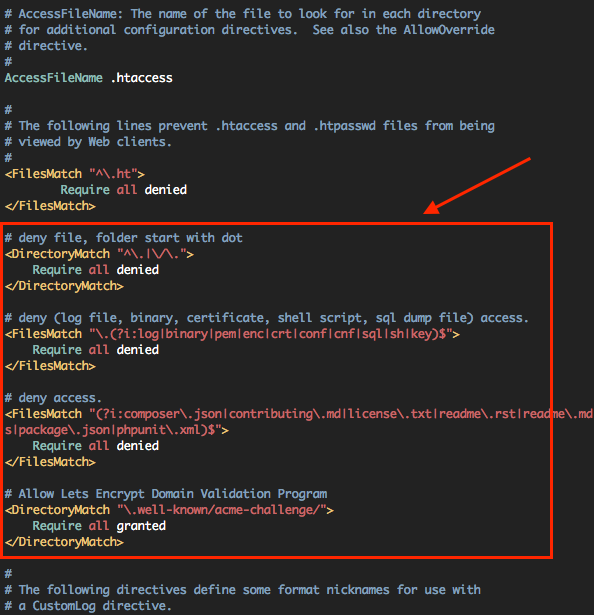

# 리눅스(우분투) 웹서버 구축    
> ## 1. 리눅스와 우분투 버전 체크    
 리눅스 : # uname -a   
 우분투 : # cat /etc/issue    
- - -
> ## 2. 용량과 메모리 체크   
 용량 : # df -h    
 메모리 : # free -m   
- - -
> ## 3. 패키지 갱신   
 목록 갱신 : # apt-get update   
 최신버전 패치 : # apt-get upgrade   
- - -
> ## 4. 시간 설정   
 : # dpkg-reconfigure tzdata    
- - -
> ## 5. 호스트 이름 설정 & 적용
 : # vi /etc/hostname    
 vi 로 호스트 이름을 설정 해준뒤 적용한다.   
 : # hostname -F /etc/hostname   
- - -
> ## 6. Apache2 설치 
 : # apt-get install apache2   
 설치가 끝난뒤 버전체크도 해준다.   
 : # apache2 -v
- - -
> ## + 6.5 기타 설정 & 보안패치
 : # a2enmod rewrite - 짧은 주소를 사용할시 설정    
 : # a2enmod headers -    
 : # a2enmod ssl -   
 : # a2dismod -f autoindex -   
 
 : # vi /etc/apache2/apache2.conf - 아래처럼 추가해준다.   
    
 dot 로 시작하는 파일 및 폴더 보호 (Web Access돼선 안될 파일 접근 제어)    
- - -
 > ## 7. PHP 7.0 설치   
 : # apt-get install php   
 : # apt-get install libapache2-mod-php7.0　-　PHP와 apache 연동모듈 설치   
- - -
 > ## + 7.5 기타 주사용 모듈 설치 (선택)
 : # apt-get install php-mbstring　-　다국어 처리 모듈   
 : # apt-get install php-gd　-　이미지 처리 모듈   
 : # apt-get install php-curl php-xml　-　원격지 정보를 불러오는 모듈   
 : # apt-cache search php-　-　추가로 설치가능한 패키지 목록   
- - -   
 > ## 8. 아파치 재시작
 : # service apache2 restart　-　재시작 해준다.   
 : # php -v　-　다시 버전을 체크해준다.   
- - -   
 > ## 9. MariaDB 설치 & 초기화
 Mysql 과 Mariadb 는 호환된다.   

 : # apt-get install mariadb-server - MariaDB 설치    
 : # /usr/bin/mysql_secure_installation - 비밀번호 설정 후 나머지는 엔터(y)   

 > ## 10. root 인증 플러그인 제거   
 Mysql에 서버사이드 인증이라는 플러그인이 있다.   
 기존의 방식인 비밀번호 인증 방식으로 바꾸도록 한다.   
 : # mysql　-　MariaDB[mysql] 접속   
 : use mysql;   
 : update user set plugin='' where User='root';   
 : flush privileges;   
 : exit;   

 > ## 11. DB 연동모듈 설치   
 호환이 완전히 되기 때문에 mysql 이라해도 MariaDB 사용가능하다.   
 : # apt-get install php-mysql