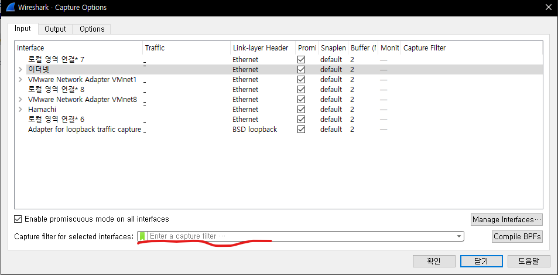
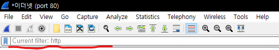

# 패킷 필터
## 1. 캡처 필터
> 동작 죽인 네트워크 트래픽 수집 과정에서 필터링한다.   
> 이미 수집한 추적 파일에는 적용할 수 없다.   

[Capture] -> [Options]
   
필터 입력 왼쪽에 있는 녹색 아이콘을 클릭하여 설정돼있는 필터들을 선택할 수 있다.   

   
## 2. 디스플레이 필터
> 이미 캡처된 패킷들을 핕터링한다.   
   
[Analyze] -> [Display filters]   
   
마찬가지로 필터 입력 왼쪽에 있는 파란 아이콘을 클릭하여 설정돼있는 필터들을 선택할 수 있다.